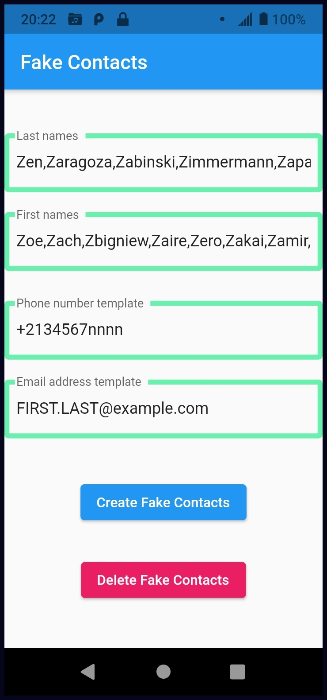

# Contacts

Android phone app that creates fake contacts, which will be stored on your smartphone along with your real contacts.  This feeds fake data to any apps or companies who are copying our private data to use or sell it.  This is called "data-poisoning".

Nothing about these fake contacts will interfere with your normal use of your phone or your real contacts.

The app is available through F-Droid.

This is a sister-application to "Fake Contacts 2", which puts fake information in some fields of all contacts.

## Functionality
The user can set lists of last names and first names for fake contacts, and phone-number and email-address templates for them.  Then click buttons to create or delete fake contacts with all combinations of the first and last names.

